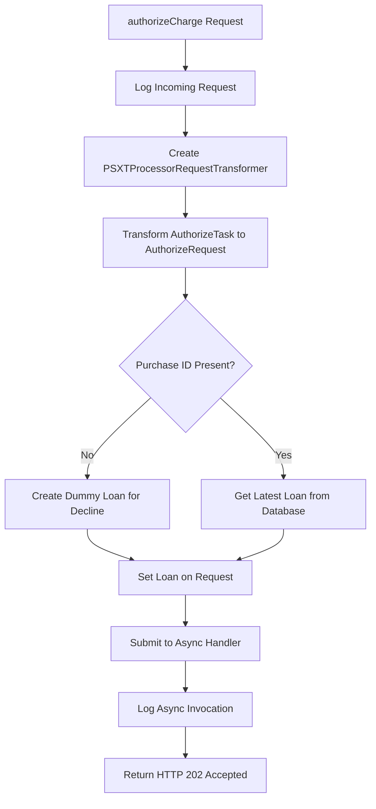
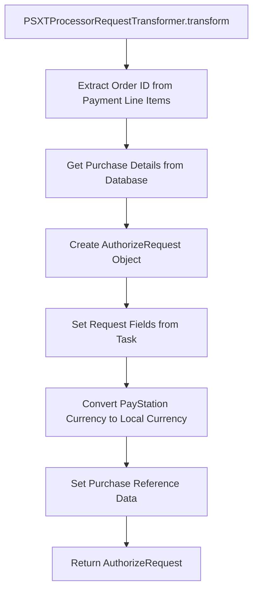
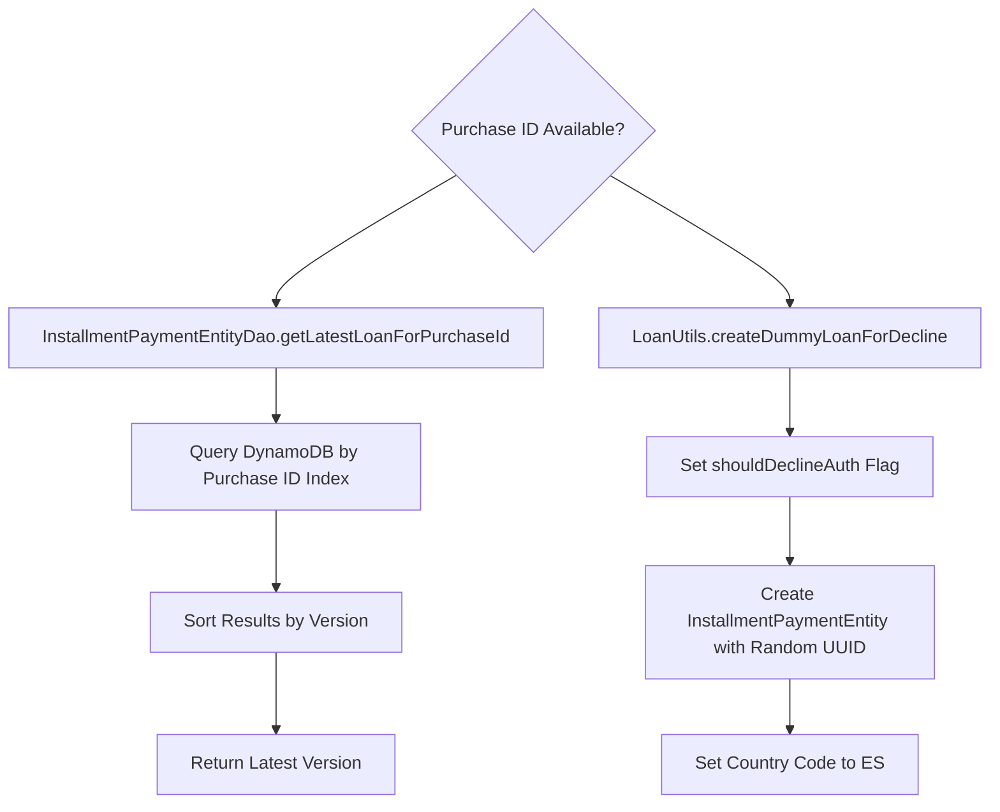
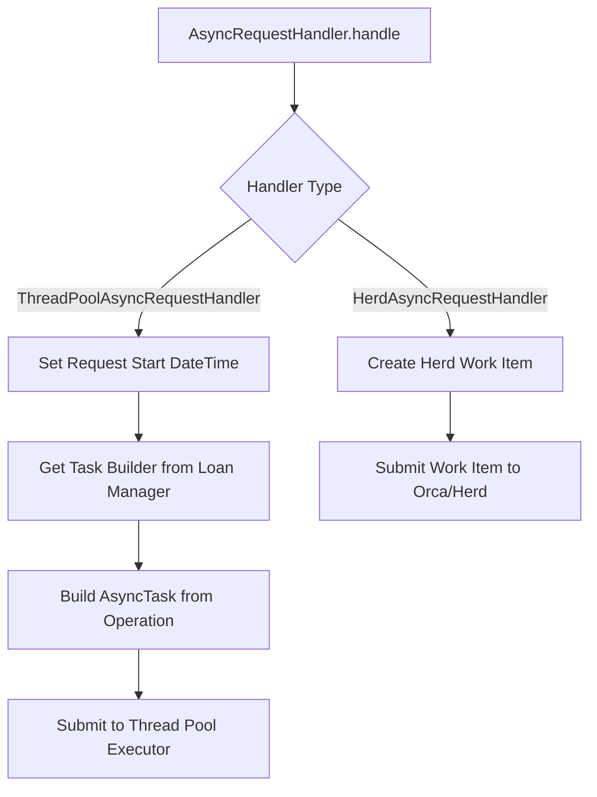
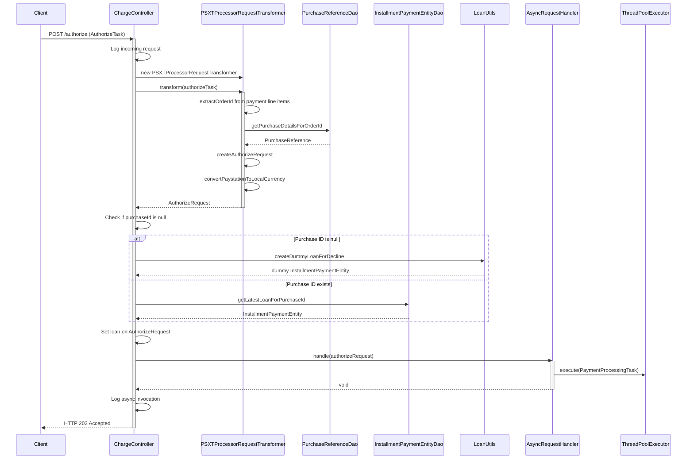
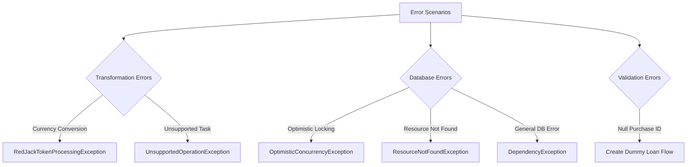

# authorizeCharge API Documentation

## Overview

The `authorizeCharge` endpoint is a REST API that handles payment authorization requests in the Santander GIL GPP (Global Installment Lending - Guaranteed Payment Program) system. This asynchronous endpoint processes authorization tasks for installment payment entities and delegates the actual processing to background handlers.

## API Specification

### Endpoint Details
- **Path**: `/authorize` (defined by [`ServiceConstants.AUTHORIZE`](../../src/com/amazon/santandergilgpparestplugin/constants/ServiceConstants.java#L10))
- **Method**: POST
- **Controller**: [`ChargeController`](../../src/com/amazon/santandergilgpparestplugin/controller/ChargeController.java#L63)
- **Content-Type**: `application/x-amzn-ion` (Ion Media Type)
- **Authentication**: AAA (Amazon Authorization Architecture) required
- **Service Name**: `SantanderGILGPPArestPlugin`
- **Operation Name**: `paymentProcessing`

### Request Format
The endpoint accepts an [`AuthorizeTask`](../../src/com/amazon/santandergilgpparestplugin/controller/ChargeController.java#L63) object in Ion format containing:
- Payment line items with order IDs
- Amount to authorize
- Processor idempotency key
- Charge ID
- Reference data for the authorization

### Response Format
- **Success Response**: HTTP 202 (Accepted) with Ion content type
- **Processing**: Asynchronous - request is queued for background processing
- **Response Body**: Empty (async processing initiated)

## Implementation Flow

### Main Authorization Flow

### Request Transformation Flow

### Loan Retrieval Flow

### Asynchronous Processing Flow

## Detailed Sequence Diagram

## Error Handling

### Exception Scenarios

### Error Response Handling
Since this is an asynchronous endpoint, errors during the initial request processing phase will result in standard HTTP error responses. However, errors during background processing are handled within the async task execution and do not affect the initial HTTP response.

## Data Models

### Key Data Structures

#### AuthorizeRequest
- **Location**: [`AuthorizeRequest.java`](../../src/com/amazon/santandergilgpparestplugin/async/requests/AuthorizeRequest.java)
- **Extends**: [`PaymentRequest`](../../src/com/amazon/santandergilgpparestplugin/async/requests/PaymentRequest.java)
- **Fields**:
  - `shouldDeclineAuth`: Boolean flag indicating if authorization should be declined
  - Inherited from PaymentRequest: requestId, paymentProcessingTaskId, originalTransactionId, requestedAmount, purchaseId, paymentContractId, orderId

#### InstallmentPaymentEntity
- **Location**: [`InstallmentPaymentEntity.java`](../../src/com/amazon/santandergilgpparestplugin/model/payment/InstallmentPaymentEntity.java)
- **Storage**: DynamoDB table with versioning support
- **Key Fields**: id, version, applicationId, purchaseId, paymentContractId, customerId

#### PurchaseReference
- **Location**: [`PurchaseReference.java`](../../src/com/amazon/santandergilgpparestplugin/model/purchase/PurchaseReference.java)
- **Storage**: DynamoDB table
- **Key Fields**: orderId, purchaseId, paymentContractId, customerId

## Configuration and Dependencies

### Dependency Injection
The [`ChargeController`](../../src/com/amazon/santandergilgpparestplugin/controller/ChargeController.java#L43) uses constructor injection for:
- [`AsyncRequestHandler`](../../src/com/amazon/santandergilgpparestplugin/async/handler/AsyncRequestHandler.java) (interface - actual implementation injected)
- [`InstallmentPaymentEntityDao`](../../src/com/amazon/santandergilgpparestplugin/accessor/dao/InstallmentPaymentEntityDao.java)
- [`PurchaseReferenceDao`](../../src/com/amazon/santandergilgpparestplugin/accessor/dao/PurchaseReferenceDao.java)
- [`LoanUtils`](../../src/com/amazon/santandergilgpparestplugin/loan/LoanUtils.java)
- [`PluginCustomFieldUtils`](../../src/com/amazon/santandergilgpparestplugin/utils/PluginCustomFieldUtils.java)

### Service Constants
- **Service Name**: `SantanderGILGPPArestPlugin`
- **Authorization Path**: `/authorize`
- **Operation Name**: `paymentProcessing`

## Database Operations

### DynamoDB Tables Accessed
1. **InstallmentPaymentEntity Table**
   - Query by purchaseId using GSI (Global Secondary Index)
   - Retrieve latest version by sorting on version attribute

2. **PurchaseReference Table**
   - Load by orderId (primary key)
   - Contains payment contract and purchase mapping data

### Database Query Patterns
- **Purchase ID Lookup**: Uses [`PAYMENT_ENTITY_PURCHASE_ID_INDEX`](../../src/com/amazon/santandergilgpparestplugin/accessor/dao/InstallmentPaymentEntityDao.java#L270) GSI
- **Version Sorting**: Results sorted by version to get latest record
- **Consistent Read**: Disabled for performance (eventual consistency acceptable)

## Integration Points

### External Services
- **PayStation**: Source of AuthorizeTask requests
- **GIL (Global Installment Lending)**: Target system for payment processing
- **DynamoDB**: Data persistence layer
- **Herd/Orca**: Workflow orchestration system (when using HerdAsyncRequestHandler)

### Async Processing Options
1. **ThreadPoolAsyncRequestHandler**: Uses local thread pool executor
2. **HerdAsyncRequestHandler**: Submits work items to Herd/Orca workflow system

## Performance Considerations

### Asynchronous Design
- Immediate HTTP 202 response for better user experience
- Background processing prevents timeout issues
- Scalable through thread pool or workflow system

### Database Optimization
- Uses GSI for efficient purchase ID queries
- Version-based sorting for latest record retrieval
- Batch operations available for bulk processing

### Caching Strategy
[CONFIGURATION DEPENDENT] - No explicit caching implemented in the current flow

## Monitoring and Observability

### Logging Points
- Request receipt and transformation
- Database query operations
- Async handler invocation
- Error conditions and exceptions

### Metrics
[VERIFICATION NEEDED] - Specific metrics configuration depends on deployed environment

## Security

### Authentication
- **AAA (Amazon Authorization Architecture)** required
- Service name: `SantanderGILGPPArestPlugin`
- Operation name: `paymentProcessing`

### Authorization
[VERIFICATION NEEDED] - Specific authorization rules depend on AAA configuration

## Source Code References

### Controllers
- [`ChargeController.java`](../../src/com/amazon/santandergilgpparestplugin/controller/ChargeController.java) - Main controller handling authorize charge requests

### Transformers
- [`PSXTProcessorRequestTransformer.java`](../../src/com/amazon/santandergilgpparestplugin/transformer/PSXTProcessorRequestTransformer.java) - Request transformation logic

### Data Access Objects
- [`InstallmentPaymentEntityDao.java`](../../src/com/amazon/santandergilgpparestplugin/accessor/dao/InstallmentPaymentEntityDao.java) - Loan entity database operations
- [`PurchaseReferenceDao.java`](../../src/com/amazon/santandergilgpparestplugin/accessor/dao/PurchaseReferenceDao.java) - Purchase reference database operations

### Request Models
- [`AuthorizeRequest.java`](../../src/com/amazon/santandergilgpparestplugin/async/requests/AuthorizeRequest.java) - Authorization request model
- [`PaymentRequest.java`](../../src/com/amazon/santandergilgpparestplugin/async/requests/PaymentRequest.java) - Base payment request model
- [`Request.java`](../../src/com/amazon/santandergilgpparestplugin/async/requests/Request.java) - Base request model

### Async Handlers
- [`AsyncRequestHandler.java`](../../src/com/amazon/santandergilgpparestplugin/async/handler/AsyncRequestHandler.java) - Async handler interface
- [`ThreadPoolAsyncRequestHandler.java`](../../src/com/amazon/santandergilgpparestplugin/async/handler/ThreadPoolAsyncRequestHandler.java) - Thread pool implementation
- [`HerdAsyncRequestHandler.java`](../../src/com/amazon/santandergilgpparestplugin/async/handler/HerdAsyncRequestHandler.java) - Herd/Orca implementation

### Utilities
- [`LoanUtils.java`](../../src/com/amazon/santandergilgpparestplugin/loan/LoanUtils.java) - Loan management utilities
- [`PluginCustomFieldUtils.java`](../../src/com/amazon/santandergilgpparestplugin/utils/PluginCustomFieldUtils.java) - Custom field processing utilities

### Constants
- [`ServiceConstants.java`](../../src/com/amazon/santandergilgpparestplugin/constants/ServiceConstants.java) - Service configuration constants
